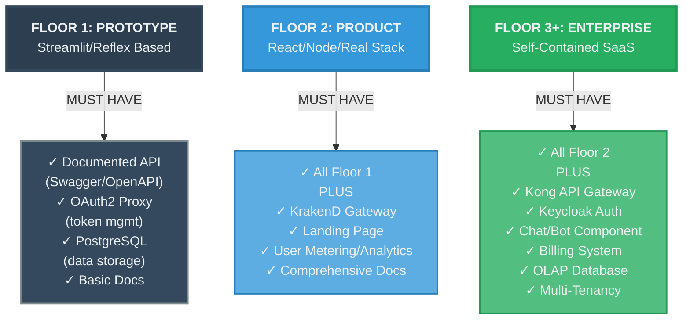
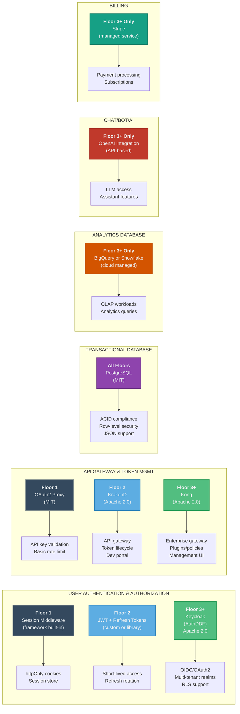
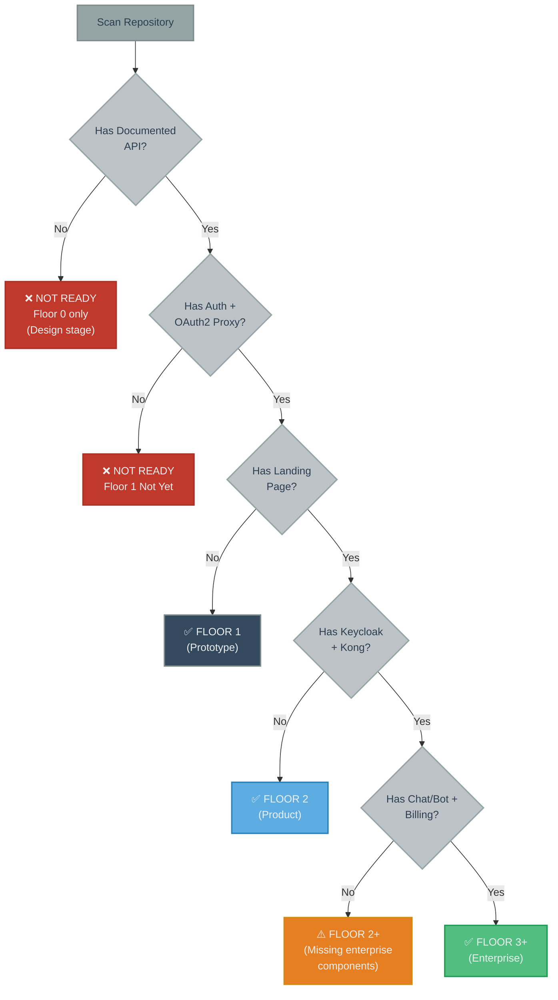

# /matp_product_components_maturity

<!-- COMMAND_ID: 060 -->
<!-- COMMAND_VERSION: 1.0.0 -->
<!-- COMMAND_TYPE: maturity_assessment -->

**Shortcut**: `matp`

**Shortcut**: `rcmp`

**Analysis only – read-only assessment of product components and technology stack.** Scan a repository to determine which development floor it qualifies for based on the **presence and maturity of key product components** (authentication, API gateway, databases, chat/bot, billing, documentation, landing page). This command produces a component scorecard and technology stack alignment report without implementing changes.

---

## Backlinks

- **Local Reference**: `standards/maturity/index_standards__maturity.yaml`
  **Git URL Reference**: `https://github.com/dadosfera/docs-fera/blob/main/standards/maturity/index_standards__maturity.yaml
- **Local Reference**: guides/devs_agents_development_framework_overview.md
  **Git URL Reference**: https://github.com/dadosfera/docs-fera/blob/main/guides/devs_agents_development_framework_overview.md

---

## Overview

This command assesses a repository's **product readiness** by:

1. **Identifying which components are present** (API documentation, authentication, databases, etc.)
2. **Checking technology choices for each component** against canonical recommendations
3. **Determining the minimum development floor** the repo qualifies for
4. **Recommending missing components** for progression to the next floor

Unlike /mass_maturity_assessment (which evaluates code quality, testing, deployment, and architecture), /rcmp` focuses specifically on **product components needed to serve external users**.

---

## Components Assessment Framework

### Component Decision Matrix

This diagram shows which components are **required** at each floor to qualify for that floor:



---

## Technology Stack Framework

### Canonical Technology per Component

For each component, use the canonical technology for your floor. Do **not** mix technologies across floors.



---

## Component Readiness Assessment

Use this table to quickly check if your repo has each component:

| Component | Floor 1 | Floor 2 | Floor 3+ | Signals to Check |
|-----------|---------|---------|----------|------------------|
| **Documented API** | ✅ Required | ✅ Required | ✅ Required | `swagger.json`, `openapi.yaml`, Postman collection |
| **Authentication System** | ✅ Required | ✅ Required | ✅ Required | Session middleware, JWT library, Keycloak integration |
| **API Gateway & Tokens** | ✅ Required (OAuth2 Proxy) | ✅ Required (KrakenD) | ✅ Required (Kong) | Token storage, expiration, rate limiting config |
| **Transactional Database** | ✅ Required (PostgreSQL) | ✅ Required (PostgreSQL) | ✅ Required (PostgreSQL) | `Dockerfile` with postgres, migration scripts, schema |
| **User Metering** | ⚠️ Optional | ✅ Required | ✅ Required | Event tracking, usage logs, analytics endpoints |
| **Landing Page** | ❌ Not required | ✅ Required | ✅ Required | `marketing/` folder, Next.js site, static site |
| **Chat/Bot Component** | ❌ Not required | ❌ Not required | ✅ Required | OpenAI integration, LLM endpoints, chat UI |
| **OLAP Database** | ❌ Not required | ❌ Not required | ✅ Required | BigQuery, Snowflake, data warehouse config |
| **Billing System** | ❌ Not required | ❌ Not required | ✅ Required | Stripe webhooks, subscription logic, payment UI |
| **Multi-Tenancy** | ❌ Not required | ⚠️ Optional | ✅ Required | Tenant schema separation, org isolation, RLS policies |

---

## Quick Floor Decision Tree



---

## Command Sequence (Run in Order)

### 1. Confirm Repository Context

```bash
gtimeout 5 git rev-parse --show-toplevel
```

- Verify the repo is accessible
- Record the absolute repo root path for references

### 2. Scan for Documented API

```bash
# Check for API documentation files
find . -maxdepth 2 -type f \( -name "swagger.json" -o -name "openapi.yaml" -o -name "openapi.yml" -o -name "*.swagger.yaml" \) 2>/dev/null | head -5

# Check for API documentation in docs/
ls -la docs/ 2>/dev/null | grep -i -E "api|swagger|openapi" | head -10

# Check package.json/pyproject.toml for API doc tools
grep -E "swagger|openapi|redoc|spectacle" package.json pyproject.toml 2>/dev/null | head -5
```

**Signal: MUST have** one of:
- `swagger.json` or `openapi.yaml`
- Documented API endpoints in `docs/API.md`
- Postman collection
- API documentation in README

### 3. Scan Authentication & Authorization

```bash
# Check for authentication middleware/libraries
grep -r "session\|passport\|jwt\|keycloak\|auth0\|firebase" package.json pyproject.toml requirements.txt 2>/dev/null | head -10

# Check for Keycloak integration (Floor 3+)
find . -maxdepth 3 -type f -name "*keycloak*" 2>/dev/null

# Check for auth configuration
find . -maxdepth 2 -type f \( -name "*auth*" -o -name "*session*" \) 2>/dev/null | grep -E "\.(ts|js|py|go)$" | head -5
```

**Signals:**
- Floor 1: Session middleware, `express-session`, `flask-session`
- Floor 2: JWT library, `jsonwebtoken`, `pyjwt`
- Floor 3+: Keycloak integration, OIDC/OAuth2 flows

### 4. Scan API Gateway & Token Management

```bash
# Check for OAuth2 Proxy (Floor 1)
grep -r "oauth2-proxy\|oauth2_proxy" docker-compose.yml Dockerfile .env* config/ 2>/dev/null

# Check for KrakenD (Floor 2)
find . -maxdepth 2 -type f -name "*krakend*" 2>/dev/null
ls -la krakend/ 2>/dev/null

# Check for Kong (Floor 3+)
find . -maxdepth 2 -type f -name "*kong*" 2>/dev/null
grep -r "kong\|admin.kong" docker-compose.yml 2>/dev/null

# Check for API token/key management
grep -r "api.key\|api_key\|token_expir\|token_rotation" src/ app/ 2>/dev/null | head -5
```

**Signals:**
- Floor 1: API key table in DB, basic expiration, OAuth2 Proxy config
- Floor 2: KrakenD config file, developer portal setup
- Floor 3+: Kong admin API, Kong Manager, plugin configs

### 5. Scan for Databases

```bash
# Transactional database (all floors)
grep -r "postgresql\|postgres\|mysql\|mariadb\|mongodb" docker-compose.yml Dockerfile package.json pyproject.toml 2>/dev/null

# Check for database migrations
find . -maxdepth 3 -type d -name "*migrat*" 2>/dev/null
ls -la db/migrations/ schema/ 2>/dev/null

# Analytics database (Floor 3+ only)
grep -r "bigquery\|snowflake\|redshift\|duckdb" package.json pyproject.toml src/ 2>/dev/null | head -5
```

**Signals:**
- All Floors: PostgreSQL in docker-compose, migration scripts
- Floor 3+ only: BigQuery/Snowflake connection, analytics queries

### 6. Scan for Landing Page & Marketing Site

```bash
# Check for landing page / marketing site
ls -la marketing/ landing/ website/ public/ 2>/dev/null
find . -maxdepth 2 -type f -name "next.config.js" -o -name "gatsby-config.js" 2>/dev/null

# Check for static site generators
grep -r "next\|gatsby\|hugo\|jekyll" package.json 2>/dev/null | head -5
```

**Signal: Required for Floor 2+**
- Must have `marketing/`, `landing/`, or `website/` folder
- Must have deployed landing page URL in README

### 7. Scan for User Metering/Analytics

```bash
# Check for analytics tracking
grep -r "mixpanel\|posthog\|segment\|analytics\|tracking" package.json pyproject.toml src/ 2>/dev/null | head -5

# Check for custom analytics
find . -maxdepth 3 -type f -name "*analytics*" -o -name "*metrics*" 2>/dev/null
```

**Signal: Required for Floor 2+**
- Must have analytics library or custom tracking
- Must log usage events

### 8. Scan for Chat/Bot/AI Components (Floor 3+ Only)

```bash
# Check for OpenAI integration
grep -r "openai\|langchain\|anthropic\|gpt" package.json pyproject.toml src/ 2>/dev/null | head -5

# Check for chat endpoints
find . -maxdepth 3 -type f -name "*chat*" -o -name "*bot*" -o -name "*assistant*" 2>/dev/null | grep -E "\.(ts|js|py)$" | head -5
```

**Signal: Required for Floor 3+ only**
- Must have OpenAI integration
- Must have chat endpoints in API

### 9. Scan for Billing System (Floor 3+ Only)

```bash
# Check for Stripe integration
grep -r "stripe\|paddle\|payment\|billing" package.json pyproject.toml src/ 2>/dev/null | head -5

# Check for subscription logic
find . -maxdepth 3 -type f -name "*billing*" -o -name "*subscription*" 2>/dev/null | grep -E "\.(ts|js|py)$" | head -5

# Check for payment webhooks
grep -r "webhook\|stripe_event\|payment.*callback" src/ 2>/dev/null | head -5
```

**Signal: Required for Floor 3+ only**
- Must have Stripe SDK
- Must have subscription/payment logic
- Must have webhook handlers

### 10. Scan for Multi-Tenancy (Floor 3+ Only)

```bash
# Check for tenant/org isolation
grep -r "tenant_id\|org_id\|workspace_id\|customer_id" src/ db/migrations/ 2>/dev/null | head -10

# Check for RLS policies (Postgres)
grep -r "CREATE POLICY\|ROW LEVEL SECURITY\|RLS" db/ 2>/dev/null | head -5

# Check for multi-org support
grep -r "multi.*tenant\|multi.*org\|tenant.*isolation" docs/ README.md 2>/dev/null | head -5
```

**Signal: Required for Floor 3+ only**
- Must have tenant schema separation
- Must have RLS policies (if Postgres)
- Must document tenant isolation model

---

## Scoring & Floor Determination

### Floor 1 (Prototype) Checklist

**MUST HAVE all:**
- ✅ Documented API (Swagger/OpenAPI)
- ✅ Authentication system (session middleware)
- ✅ OAuth2 Proxy for token management
- ✅ PostgreSQL or equivalent database
- ✅ Basic documentation

**IF ANY missing → NOT Floor 1 ready**

### Floor 2 (Product) Checklist

**MUST HAVE all Floor 1 requirements PLUS:**
- ✅ KrakenD or equivalent API gateway
- ✅ Landing page with marketing site
- ✅ User metering/analytics tracking
- ✅ Comprehensive API documentation
- ✅ JWT or session-based user authentication

**IF ANY missing → Upgrade to Floor 1 first, then Floor 2**

### Floor 3+ (Enterprise) Checklist

**MUST HAVE all Floor 2 requirements PLUS:**
- ✅ Kong API gateway (not KrakenD)
- ✅ Keycloak for user authentication
- ✅ Chat/bot or AI assistant component
- ✅ Billing system (Stripe integration)
- ✅ OLAP database (BigQuery/Snowflake)
- ✅ Multi-tenancy with RLS enforcement

**IF ANY missing → Upgrade to Floor 2 first, then Floor 3+**

---

## Deliverables

The command produces:

1. **Component Readiness Scorecard** (`analysis/component_maturity_report.md`)
   - Table: Component presence per floor
   - Current floor qualification
   - Missing components for next floor

2. **Technology Stack Alignment Report** (`analysis/tech_stack_alignment.md`)
   - Current tech per component
   - Deviations from canonical recommendations
   - Upgrade path if needed

3. **Floor Qualification Summary** (conversation output)
   - Minimum floor the repo qualifies for
   - Specific missing components
   - Recommended mini-prompts to add missing components

---

## Related Commands & Resources

- **Related Reference**: `standards/maturity/software_lifecycle_maturity.md`
  **Git URL Reference**: `https://github.com/dadosfera/docs-fera/blob/main/standards/maturity/software_lifecycle_maturity.md
- **Related Command**: /mass_maturity_assessment – for code quality, testing, and deployment maturity
- **Related Mini-Prompt**: mini_prompt/lv2/authentication_maturity_analysis_and_improvement_mini_prompt.md
  **Git URL Reference**: `https://github.com/dadosfera/docs-fera/blob/main/mini_prompt/lv2/authentication_maturity_analysis_and_improvement_mini_prompt.md

---

## Notes

- This is a **read-only assessment command**: it scans for component presence and technology alignment without making changes.
- Components must be **present AND functional**: finding a package.json with Keycloak listed is not sufficient; Keycloak must be configured and running.
- Technology choices are **not negotiable per floor**: if you're Floor 2, you must use KrakenD for API gateway, not Kong.
- Keep executions bounded: avoid scanning huge monorepos exhaustively; favor top-level folders and critical config files when gathering signals.

---

*Last Updated: 2025-12-22*
*Version: 1.0*
