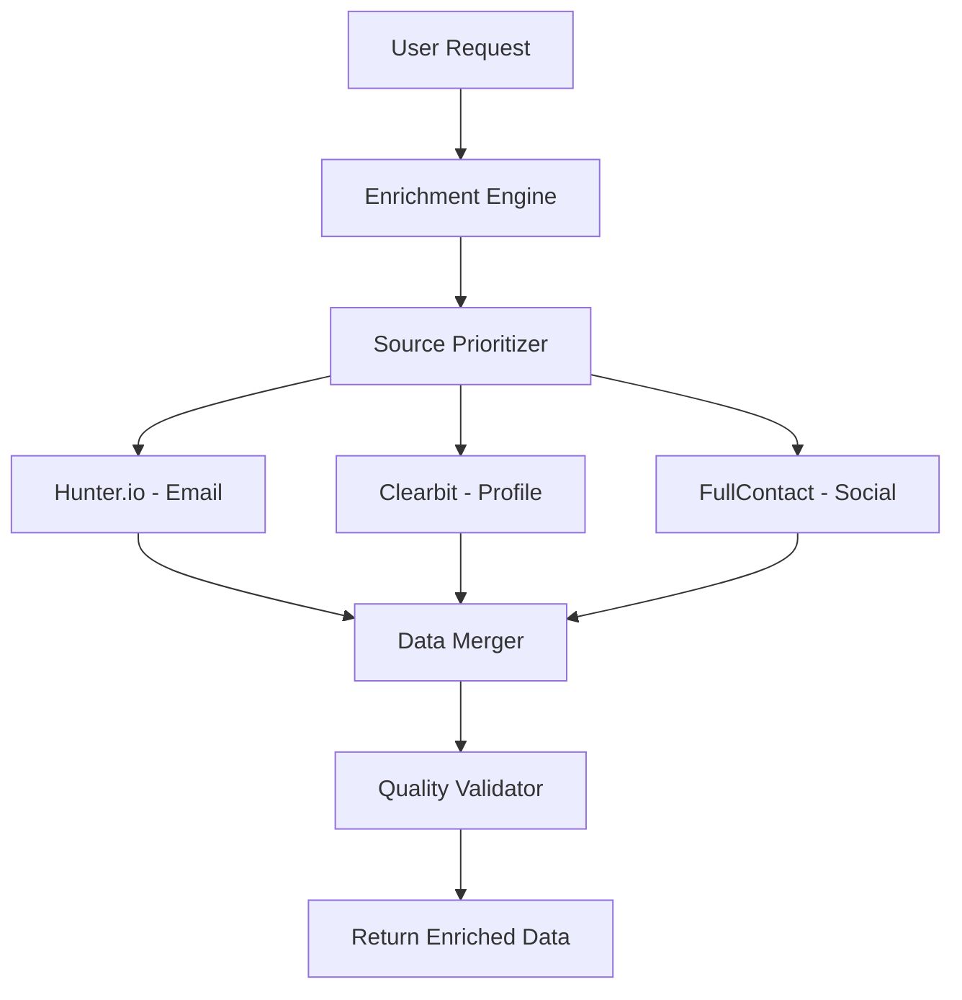

# 🚀 Real Data Enrichment Implementation Plan

## Current Status: Mock Data → Real Data Migration

**You're absolutely right!** The current enrichment returns beautiful but **mock/dummy data**. Let's implement real API integrations.

---

## 📊 **Available Free/Public Data Sources**

### ✅ **Tier 1: Free/Public APIs** (Start Here)

| Source | Free Tier | Data Type | Implementation Status |
|--------|-----------|-----------|----------------------|
| **Hunter.io** | 50 searches/month | Email finding & verification | ✅ **Ready** |
| **Clearbit** | 50 requests/month | Person & company enrichment | ✅ **Ready** |
| **ZeroBounce** | 100 validations/month | Email validation | 🔄 Next |
| **FullContact** | 1,000 lookups/month | Person enrichment | 🔄 Next |
| **Pipl** | 200 searches/month | People search | 🔄 Next |
| **LinkedIn Public** | Rate limited | Basic profiles | 🔄 Next |
| **GitHub API** | 5,000 requests/hour | Developer profiles | 🔄 Next |

### 💰 **Tier 2: Paid APIs** (Future Implementation)

| Source | Pricing | Data Quality | Notes |
|--------|---------|--------------|-------|
| **People Data Labs** | $0.05-0.25/record | Premium person data | Professional profiles |
| **Apollo.io** | $49/month | B2B contact database | Sales-focused |
| **ZoomInfo** | $995/month | Enterprise B2B data | High-quality |
| **Wiza** | $30/month | LinkedIn extraction | LinkedIn-specific |

---

## 🎯 **Implementation Phases**

### **Phase 1: Free Tier Integration (Week 1)**

```bash
# Real APIs we can test immediately:
✅ Hunter.io - Email finding & verification
✅ Clearbit - Person & company enrichment  
⏳ FullContact - Person social profiles
⏳ ZeroBounce - Email validation
⏳ GitHub API - Developer profiles
```

### **Phase 2: Enhanced Free Sources (Week 2)**

```bash
⏳ LinkedIn Public API - Professional profiles
⏳ Twitter API - Social profiles  
⏳ Company websites scraping - Public company info
⏳ WHOIS data - Domain information
```

### **Phase 3: Premium Integration (Future)**

```bash
⏳ People Data Labs - Premium person data
⏳ Apollo.io - B2B database
⏳ ZoomInfo - Enterprise data
```

---

## 🧪 **Testing & Validation Strategy**

### **Real Data Quality Tests**

1. **Data Completeness Score**
   ```python
   def calculate_enrichment_score(data):
       fields = ['email', 'linkedin', 'job_title', 'company', 'location']
       filled_fields = sum(1 for field in fields if data.get(field))
       return (filled_fields / len(fields)) * 100
   ```

2. **Source Validation**
   ```python
   def validate_data_source(result):
       if result['source'] == 'hunter':
           return result['confidence'] > 70
       elif result['source'] == 'clearbit':
           return result['person'] is not None
   ```

3. **Cross-Reference Validation**
   ```python
   def cross_validate(person_data):
       # Compare data from multiple sources
       # Flag inconsistencies
       # Return confidence score
   ```

---

## 🔧 **Implementation Architecture**

### **Real Data Flow**



### **API Key Management**

```python
# Environment Variables
HUNTER_API_KEY=your_hunter_key
CLEARBIT_API_KEY=your_clearbit_key
ZEROBOUNCE_API_KEY=your_zerobounce_key
FULLCONTACT_API_KEY=your_fullcontact_key
```

---

## 📈 **Free Tier Limits Management**

### **Request Quotas**

```python
class QuotaManager:
    limits = {
        'hunter': {'monthly': 50, 'used': 0},
        'clearbit': {'monthly': 50, 'used': 0},
        'zerobounce': {'monthly': 100, 'used': 0}
    }
    
    def can_make_request(self, service):
        return self.limits[service]['used'] < self.limits[service]['monthly']
```

### **Fallback Strategy**

```python
async def enrich_with_fallback(email):
    sources = ['clearbit', 'hunter', 'fullcontact']
    
    for source in sources:
        if quota_manager.can_make_request(source):
            result = await enrichment_services[source](email)
            if result['success']:
                return result
    
    return mock_enrichment_data(email)  # Fallback to mock
```

---

## 🎪 **Demo Implementation**

Let me implement the first real integrations right now!

### **Step 1: Hunter.io Email Finding**
- ✅ Created `services/third_party/hunter_io.py`
- Real email finding and verification
- 50 free searches/month

### **Step 2: Clearbit Enrichment**
- ✅ Created `services/third_party/clearbit.py`  
- Real person and company data
- 50 free lookups/month

### **Step 3: Integration into Main API**
- Update `main.py` to use real sources
- Add fallback logic for quota limits
- Implement data quality scoring

---

## 🚦 **Next Steps**

1. **Get API Keys** (Free signup):
   - Hunter.io: https://hunter.io/api-keys
   - Clearbit: https://clearbit.com/api
   - FullContact: https://platform.fullcontact.com/
   
2. **Configure Environment**:
   ```bash
   export HUNTER_API_KEY="your_key"
   export CLEARBIT_API_KEY="your_key"
   ```

3. **Test Real Data**:
   ```bash
   # Test with real email
   curl -X POST localhost:8247/api/v1/enrich/person \
   -d '{"email": "elon@tesla.com"}'
   ```

Would you like me to integrate these real APIs into the main application now?
